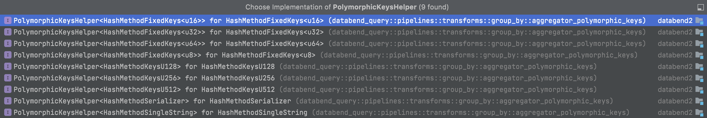
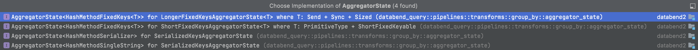

* [五 Aggregation](#五-aggregation)
  * [Build Pipeline](#build-pipeline)
    * [V1](#v1)
      * [QueryPipelineBuilder](#querypipelinebuilder)
    * [V2](#v2)
      * [PipelineBuilder](#pipelinebuilder)
  * [关键模块](#关键模块)
    * [TransformAggregator](#transformaggregator)
    * [AggregatorTransform](#aggregatortransform)
    * [Aggregator(trait)](#aggregatortrait)
    * [PartialAggregator](#partialaggregator)
    * [FinalAggregator](#finalaggregator)
    * [HashMethod(trait)](#hashmethodtrait)
      * [HashMethodSingleString](#hashmethodsinglestring)
    * [PolymorphicKeyHelper(trait)](#polymorphickeyhelpertrait)
      * [HashMethodSingleString](#hashmethodsinglestring)
    * [AggregatorState(trait)](#aggregatorstatetrait)
      * [SerializedKeysAggregatorState](#serializedkeysaggregatorstate)
    * [HashTable/HashMapKind/HashTableKind](#hashtablehashmapkindhashtablekind)
    * [AggregateFunction(trait)](#aggregatefunctiontrait)
      * [AggregateCountFunction](#aggregatecountfunction)

## 五 Aggregation

### Build Pipeline

#### V1

##### QueryPipelineBuilder

```rust
// file: query/src/pipelines/new/pipeline_builder.rs
    fn visit_plan_node(&mut self, node: &PlanNode) -> Result<()> {
        match node {
            ...
            PlanNode::AggregatorPartial(n) => self.visit_aggregate_partial(n),
            PlanNode::AggregatorFinal(n) => self.visit_aggregate_final(n),
            ...
        }
    }
// func: visit_aggregate_partial(...)
// 创建Partial Aggregator Processor
    fn visit_aggregate_partial(&mut self, plan: &AggregatorPartialPlan) -> Result<()> {
        self.visit_plan_node(&plan.input)?;

        let aggregator_params = AggregatorParams::try_create(
            &plan.aggr_expr,
            &plan.group_expr,
            &plan.input.schema(),
            &plan.schema(),
        )?;
        self.pipeline
            .add_transform(|transform_input_port, transform_output_port| {
                TransformAggregator::try_create_partial( // 创建Partial Aggregator Processor
                    transform_input_port.clone(),
                    transform_output_port.clone(),
                    AggregatorTransformParams::try_create(
                        transform_input_port,
                        transform_output_port,
                        &aggregator_params,
                    )?,
                    self.ctx.clone(),
                )
            })
    }
// func: visit_aggregate_final(...)
// 创建Final Aggregator Processor
    fn visit_aggregate_final(&mut self, plan: &AggregatorFinalPlan) -> Result<()> {
        self.visit_plan_node(&plan.input)?;

        self.pipeline.resize(1)?;
        let aggregator_params = AggregatorParams::try_create(
            &plan.aggr_expr,
            &plan.group_expr,
            &plan.schema_before_group_by,
            &plan.schema,
        )?;
        self.pipeline
            .add_transform(|transform_input_port, transform_output_port| {
                TransformAggregator::try_create_final( // 创建Final Aggregator Processor
                    transform_input_port.clone(),
                    transform_output_port.clone(),
                    AggregatorTransformParams::try_create(
                        transform_input_port,
                        transform_output_port,
                        &aggregator_params,
                    )?,
                    self.ctx.clone(),
                )
            })
    }

```

#### V2

##### PipelineBuilder

```rust
// file: query/src/sql/exec/mod.rs
// func: 
    pub fn build_pipeline(
        &mut self,
        context: Arc<QueryContext>,
        s_expr: &SExpr,
        pipeline: &mut NewPipeline,
    ) -> Result<DataSchemaRef> {
        let plan = s_expr.plan();

        match plan {
            ...
            RelOperator::Aggregate(aggregate) => {
                let input_schema =
                    self.build_pipeline(context.clone(), s_expr.child(0)?, pipeline)?;
                self.build_aggregate(context, aggregate, input_schema, pipeline)
            }
            ...
        }
    }
// func: 
    fn build_aggregate(
        &mut self,
        ctx: Arc<QueryContext>,
        aggregate: &AggregatePlan,
        input_schema: DataSchemaRef,
        pipeline: &mut NewPipeline,
    ) -> Result<DataSchemaRef> {
        ...
        pipeline.add_transform(|transform_input_port, transform_output_port| {
            TransformAggregator::try_create_partial( // 创建Partial Aggregator Processor
                transform_input_port.clone(),
                transform_output_port.clone(),
                AggregatorTransformParams::try_create(
                    transform_input_port,
                    transform_output_port,
                    &partial_aggr_params,
                )?,
                ctx.clone(),
            )
        })?;
        ...
        pipeline.add_transform(|transform_input_port, transform_output_port| {
            TransformAggregator::try_create_final(  // 创建Final Aggregator Processor
                transform_input_port.clone(),
                transform_output_port.clone(),
                AggregatorTransformParams::try_create(
                    transform_input_port,
                    transform_output_port,
                    &final_aggr_params,
                )?,
                ctx.clone(),
            )
        })?;
    }
```

#### 关键模块

##### TransformAggregator

```rust
// file: query/src/pipelines/new/processors/transforms/transform_aggregator.rs
// 创建Porcessor的辅助struct
pub struct TransformAggregator;
// func: try_create_partial(...) -> ProcessorPtr
// 根据不同的聚合key类型和是否有聚合函数，创建partial aggregate processor
    pub fn try_create_partial(
        input_port: Arc<InputPort>,
        output_port: Arc<OutputPort>,
        transform_params: AggregatorTransformParams,
        ctx: Arc<QueryContext>,
    ) -> Result<ProcessorPtr> {
        ...
        match aggregator_params.aggregate_functions.is_empty() { // 无聚合函数
            true => match transform_params.method {
                HashMethodKind::KeysU8(method) => AggregatorTransform::create(
                    transform_params.transform_input_port,
                    transform_params.transform_output_port,
                    KeysU8PartialAggregator::<false>::create(ctx, method, aggregator_params), // 使用KeysXXPartialAggregator<flase>
                ),  
                ...
            }
            false => match transform_params.method { // 有聚合函数
                HashMethodKind::KeysU8(method) => AggregatorTransform::create(
                    transform_params.transform_input_port,
                    transform_params.transform_output_port,
                    KeysU8PartialAggregator::<true>::create(ctx, method, aggregator_params), // 使用KeysXXPartialAggregator<true>
                ),
                ...
            }
    }
// func: try_create_final(...) -> ProcessorPtr
// 根据不同的聚合key类型和是否有聚合函数，创建final aggregate processor
    pub fn try_create_final(
        input_port: Arc<InputPort>,
        output_port: Arc<OutputPort>,
        transform_params: AggregatorTransformParams,
        ctx: Arc<QueryContext>,
    ) -> Result<ProcessorPtr> {
        ...
        match aggregator_params.aggregate_functions.is_empty() { // 无聚合函数
            true => match transform_params.method {
                HashMethodKind::KeysU8(method) => AggregatorTransform::create(
                    transform_params.transform_input_port,
                    transform_params.transform_output_port,
                    KeysU8FinalAggregator::<false>::create(ctx, method, aggregator_params)?, // 使用KeysXXFinalAggregator<false>
                ),
                ...
            }
            false => match transform_params.method { // 有聚合函数
                HashMethodKind::KeysU8(method) => AggregatorTransform::create(
                    transform_params.transform_input_port,
                    transform_params.transform_output_port,
                    KeysU8FinalAggregator::<true>::create(ctx, method, aggregator_params)?, // 使用KeysXXFinalAggregator<true>
                ),
                ...
            }
    }

```

##### AggregatorTransform

```rust
// file: query/src/pipelines/new/processors/transforms/transform_aggregator.rs
enum AggregatorTransform<TAggregator: Aggregator> {
    ConsumeData(ConsumeState<TAggregator>),
    Generate(GenerateState<TAggregator>),
    Finished,
}
// func: create(...) -> ProcessorPtr
// 创建AggregatorTransform
    pub fn create(
        input_port: Arc<InputPort>,
        output_port: Arc<OutputPort>,
        inner: TAggregator,
    ) -> Result<ProcessorPtr> {
        Ok(ProcessorPtr::create(Box::new(AggregatorTransform::<
            TAggregator,
        >::ConsumeData(
            ConsumeState {
                inner,
                input_port,
                output_port,
                input_data_block: None,
            },
        ))))
    }
// func: consume_event()
// 从上游算子获取数据
    fn consume_event(&mut self) -> Result<Event> {
        if let AggregatorTransform::ConsumeData(state) = self {
            if state.input_data_block.is_some() {
                return Ok(Event::Sync);
            }

            if state.input_port.is_finished() {
                let mut temp_state = AggregatorTransform::Finished;
                std::mem::swap(self, &mut temp_state);
                temp_state = temp_state.convert_to_generate()?; // 上游已经无数据，转换类型ConsumeData -> Generate
                std::mem::swap(self, &mut temp_state);
                debug_assert!(matches!(temp_state, AggregatorTransform::Finished));
                return Ok(Event::Sync);
            }

            return match state.input_port.has_data() {
                true => {
                    state.input_data_block = Some(state.input_port.pull_data().unwrap()?);
                    Ok(Event::Sync)
                }
                false => {
                    state.input_port.set_need_data();
                    Ok(Event::NeedData)
                }
            };
        }

        Err(ErrorCode::LogicalError("It's a bug"))
    }
impl<TAggregator: Aggregator + 'static> Processor for AggregatorTransform<TAggregator> {
    fn name(&self) -> &'static str {
        TAggregator::NAME
    }

    fn event(&mut self) -> Result<Event> {
        match self {
            AggregatorTransform::Finished => Ok(Event::Finished),
            AggregatorTransform::Generate(_) => self.generate_event(), // 4 产出数据
            AggregatorTransform::ConsumeData(_) => self.consume_event(), // 1 获取数据
        }
    }

    fn process(&mut self) -> Result<()> {
        match self {
            AggregatorTransform::Finished => Ok(()),
            AggregatorTransform::ConsumeData(state) => state.consume(), // 2 聚合，调用Aggregator的consume()
            AggregatorTransform::Generate(state) => state.generate(), // 3 生成聚合结果，调用Aggregator的generate()
        }
    }
}

struct ConsumeState<TAggregator: Aggregator> {
    inner: TAggregator,
    input_port: Arc<InputPort>,
    output_port: Arc<OutputPort>,
    input_data_block: Option<DataBlock>,
}

impl<TAggregator: Aggregator> ConsumeState<TAggregator> {
    pub fn consume(&mut self) -> Result<()> {
        if let Some(input_data) = self.input_data_block.take() {
            self.inner.consume(input_data)?;
        }

        Ok(())
    }
}
```

##### Aggregator(trait)

聚合算子，实现的struct有：PartialAggregator和FinalAggregator

```rust
// file: query/src/pipelines/new/processors/transforms/transform_aggregator.rs
pub trait Aggregator: Sized + Send {
    const NAME: &'static str;

    fn consume(&mut self, data: DataBlock) -> Result<()>;
    fn generate(&mut self) -> Result<Option<DataBlock>>;
}
```

##### PartialAggregator

```rust
// file: query/src/pipelines/new/processors/transforms/aggregator/aggregator_partial.rs
// 泛型，partial aggregate的执行框架，聚合键的转化、聚合函数的状态等是由Method控制；HAS_AGG标志是否有聚合函数
pub struct PartialAggregator<
    const HAS_AGG: bool,
    Method: HashMethod + PolymorphicKeysHelper<Method>,
> {
    is_generated: bool,
    states_dropped: bool,

    method: Method,
    state: Method::State,
    params: Arc<AggregatorParams>,
    ctx: Arc<QueryContext>,
}

// 1. 带聚合函数的情况
impl<Method: HashMethod + PolymorphicKeysHelper<Method> + Send> Aggregator
    for PartialAggregator<true, Method>
{
    const NAME: &'static str = "PartialAggregator";

    fn consume(&mut self, block: DataBlock) -> Result<()> {
        // 1.1 and 1.2.
        let group_columns = Self::group_columns(&self.params.group_columns_name, &block)?; // 获取聚合key的所有列
        let group_keys = self.method.build_keys(&group_columns, block.num_rows())?; // 把聚合的列转为HashMap的key

        // 计算使用two level hashmap的阈值
        let group_by_two_level_threshold =
            self.ctx.get_settings().get_group_by_two_level_threshold()? as usize;
        if !self.state.is_two_level() && self.state.len() >= group_by_two_level_threshold {
            self.state.convert_to_two_level();
        }
  
        let places = Self::lookup_state(&self.params, group_keys, &mut self.state); // 获取每个group key的StateAddr
        Self::execute(&self.params, &block, &places) // 执行聚合函数
    }

    fn generate(&mut self) -> Result<Option<DataBlock>> {
        self.generate_data()
    }
}
// func: lookup_state(...) -> StateAddrs
// 获取每个group key对应的StateAddr，其中StateAddr是一个内存地址
    fn lookup_state(
        params: &Arc<AggregatorParams>,
        keys: Vec<Method::HashKey<'_>>,
        state: &mut Method::State,
    ) -> StateAddrs {
        let mut places = Vec::with_capacity(keys.len());

        let mut inserted = true;
        for key in keys.iter() {
            let entity = state.entity(key, &mut inserted);

            match inserted {
                true => { // 当前key不存在，需要开辟新的内存
                    if let Some(place) = state.alloc_layout2(params) {
                        places.push(place);
                        entity.set_state_value(place.addr());
                    }
                }
                false => { // 当前key已存在，直接返回内存地址
                    let place: StateAddr = (*entity.get_state_value()).into();
                    places.push(place);
                }
            }
        }
        places
    }
// func: execute(...)
// 执行聚合函数
    fn execute(
        params: &Arc<AggregatorParams>,
        block: &DataBlock,
        places: &StateAddrs,
    ) -> Result<()> {
        let aggregate_functions = &params.aggregate_functions;
        let offsets_aggregate_states = &params.offsets_aggregate_states;
        let aggregate_arguments_columns = Self::aggregate_arguments(block, params)?; // 获取每个聚合函数需要的列

        // This can benificial for the case of dereferencing
        // This will help improve the performance ~hundreds of megabits per second
        let aggr_arg_columns_slice = &aggregate_arguments_columns;

        for index in 0..aggregate_functions.len() {
            let rows = block.num_rows();
            let function = &aggregate_functions[index];
            let state_offset = offsets_aggregate_states[index];
            let function_arguments = &aggr_arg_columns_slice[index];
            function.accumulate_keys(places, state_offset, function_arguments, rows)?;
        }

        Ok(())
    }
```

##### FinalAggregator

```rust
// file: query/src/pipelines/new/processors/transforms/aggregator/aggregator_final.rs
// 泛型
pub struct FinalAggregator<
    const HAS_AGG: bool,
    Method: HashMethod + PolymorphicKeysHelper<Method> + Send,
> {
    is_generated: bool,
    states_dropped: bool,

    method: Method,
    state: Method::State,
    params: Arc<AggregatorParams>,
    // used for deserialization only, so we can reuse it during the loop
    temp_place: Option<StateAddr>,
    ctx: Arc<QueryContext>,
}
```

##### HashMethod(trait)

```rust
// file: common/datablocks/src/kernels/data_block_group_by_hash.rs
// 负责序列化聚合key，便于放入AggregatorState（HashMap）中
pub trait HashMethod {
    type HashKey<'a>: std::cmp::Eq + Hash + Clone + Debug
    where Self: 'a;
// func: 
// 返回实现的name
    fn name(&self) -> String;
// 测试用，group by逻辑的具体实现
    fn group_by_get_indices<'a>(
        &self,
        block: &'a DataBlock,
        column_names: &[String],
    ) -> Result<GroupIndices<Self::HashKey<'a>>> {}
// 测试用，group by入口
    fn group_by<'a>(
        &self,
        block: &'a DataBlock,
        column_names: &[String],
    ) -> Result<GroupBlock<Self::HashKey<'a>>> {
        let group_indices = self.group_by_get_indices(block, column_names)?;
        ...
    }
// 构建group by key, 在PartialAggregator.consume()中调用
    fn build_keys<'a>(
        &self,
        group_columns: &[&'a ColumnRef],
        rows: usize,
    ) -> Result<Vec<Self::HashKey<'a>>>;
}
```


###### HashMethodSingleString

```rust
// file: common/datablocks/src/kernels/data_block_group_by_hash.rs
pub struct HashMethodSingleString {}
impl HashMethodSingleString {
    #[inline]
    pub fn get_key(&self, column: &StringColumn, row: usize) -> Vec<u8> {
        let v = column.get_data(row);
        v.to_owned()
    }

    pub fn deserialize_group_columns(
        &self,
        keys: Vec<Vec<u8>>,
        group_fields: &[DataField],
    ) -> Result<Vec<ColumnRef>> {
        debug_assert!(!keys.is_empty());
        debug_assert!(group_fields.len() == 1);
        let column = StringColumn::new_from_slice(&keys);
        Ok(vec![column.arc()])
    }
}

impl HashMethod for HashMethodSingleString {
    type HashKey<'a> = &'a [u8];

    fn name(&self) -> String {
        "SingleString".to_string()
    }

    fn build_keys<'a>(
        &self,
        group_columns: &[&'a ColumnRef],
        rows: usize,
    ) -> Result<Vec<&'a [u8]>> {
        debug_assert!(group_columns.len() == 1);
        let column = group_columns[0];
        let str_column: &StringColumn = Series::check_get(column)?;

        let mut values = Vec::with_capacity(rows);
        for row in 0..rows {
            values.push(str_column.get_data(row));
        }
        Ok(values)
    }
}

// file: query/src/pipelines/transforms/group_by/aggregator_polymorphic_keys.rs
impl PolymorphicKeysHelper<HashMethodSingleString> for HashMethodSingleString {
    ...
}
```

##### PolymorphicKeyHelper(trait)

```rust
// file: query/src/pipelines/transforms/group_by/aggregator_polymorphic_keys.rs
// 负责创建AggregatorState，遍历聚合的key值，辅助反序列化聚合key用于输出
pub trait PolymorphicKeysHelper<Method: HashMethod> {
    type State: AggregatorState<Method>;
    fn aggregate_state(&self) -> Self::State; // 创建State,在创建PartialAggregator和FinalAggregator时调用

    type ColumnBuilder: KeysColumnBuilder<<Self::State as AggregatorState<Method>>::Key>;
    fn keys_column_builder(&self, capacity: usize) -> Self::ColumnBuilder; // 构造生成聚合结果key的Builder，在PartialAggregator.generate_data()中调用

    type KeysColumnIter: KeysColumnIter<<Self::State as AggregatorState<Method>>::Key>;
    fn keys_iter_from_column(&self, column: &ColumnRef) -> Result<Self::KeysColumnIter>; // 返回聚合key的迭代器，在FinalAggregator.consume()中调用

    type GroupColumnsBuilder: GroupColumnsBuilder<<Self::State as AggregatorState<Method>>::Key>;
    fn group_columns_builder( // 在FinalAggregator.gennerate()中调用
        &self,
        capacity: usize,
        params: &AggregatorParams,
    ) -> Self::GroupColumnsBuilder;
}
```



###### HashMethodSingleString

```rust
// file: common/datablocks/src/kernels/data_block_group_by_hash.rs
pub struct HashMethodSingleString {}

impl HashMethod for HashMethodSingleString {
    ...
}

// file: query/src/pipelines/transforms/group_by/aggregator_polymorphic_keys.rs
impl PolymorphicKeysHelper<HashMethodSingleString> for HashMethodSingleString {
    type State = SerializedKeysAggregatorState;
    fn aggregate_state(&self) -> Self::State {
        SerializedKeysAggregatorState {
            keys_area: Bump::new(),
            state_area: Bump::new(),
            data_state_map: HashMapKind::create_hash_table(),
            two_level_flag: false,
        }
    }

    type ColumnBuilder = SerializedKeysColumnBuilder;
    fn keys_column_builder(&self, capacity: usize) -> Self::ColumnBuilder {
        SerializedKeysColumnBuilder {
            inner_builder: MutableStringColumn::with_capacity(capacity),
        }
    }

    type KeysColumnIter = SerializedKeysColumnIter;
    fn keys_iter_from_column(&self, column: &ColumnRef) -> Result<Self::KeysColumnIter> {
        SerializedKeysColumnIter::create(Series::check_get::<StringColumn>(column)?)
    }

    type GroupColumnsBuilder = SingleStringGroupColumnsBuilder;
    fn group_columns_builder(
        &self,
        capacity: usize,
        params: &AggregatorParams,
    ) -> Self::GroupColumnsBuilder {
        SingleStringGroupColumnsBuilder::create(capacity, params)
    }
}
```

##### AggregatorState(trait)

```rust
// file: query/src/pipelines/transforms/group_by/aggregator_state.rs
// 封装HashMap
pub trait AggregatorState<Method: HashMethod>: Sync + Send {
    type Key;
    type Entity: StateEntity<Self::Key>;
    type Iterator: Iterator<Item = *mut Self::Entity>;

    fn len(&self) -> usize;

    fn iter(&self) -> Self::Iterator;

    fn alloc_place(&self, layout: Layout) -> StateAddr;

    fn alloc_layout(&self, params: &AggregatorParams) -> Option<StateAddr> {
        params.layout?;
        let place: StateAddr = self.alloc_place(params.layout.unwrap());

        for idx in 0..params.offsets_aggregate_states.len() {
            let aggr_state = params.offsets_aggregate_states[idx];
            let aggr_state_place = place.next(aggr_state);
            params.aggregate_functions[idx].init_state(aggr_state_place);
        }
        Some(place)
    }

    fn alloc_layout2(&self, params: &NewAggregatorParams) -> Option<StateAddr> {
        params.layout?;
        let place: StateAddr = self.alloc_place(params.layout.unwrap());

        for idx in 0..params.offsets_aggregate_states.len() {
            let aggr_state = params.offsets_aggregate_states[idx];
            let aggr_state_place = place.next(aggr_state);
            params.aggregate_functions[idx].init_state(aggr_state_place);
        }
        Some(place)
    }

    fn entity(&mut self, key: &Method::HashKey<'_>, inserted: &mut bool) -> *mut Self::Entity;

    fn entity_by_key(&mut self, key: &Self::Key, inserted: &mut bool) -> *mut Self::Entity;

    fn is_two_level(&self) -> bool {
        false
    }

    fn convert_to_two_level(&mut self) {}
}

```



###### SerializedKeysAggregatorState

```rust
// file: query/src/pipelines/transforms/group_by/aggregator_state.rs
pub struct SerializedKeysAggregatorState {
    pub keys_area: Bump,
    pub state_area: Bump,
    pub data_state_map: HashMapKind<KeysRef, usize>, // HashMap
    pub two_level_flag: bool,
}
```

##### HashTable/HashMapKind/HashTableKind

```rust
// file: query/src/common/hashtable/mod.rs
pub type HashMap<Key, Value> = HashTable<Key, KeyValueEntity<Key, Value>, SingleLevelGrower>;
pub type TwoLevelHashMap<Key, Value> =
    TwoLevelHashTable<Key, KeyValueEntity<Key, Value>, TwoLevelGrower>;
pub type HashMapIteratorKind<Key, Value> = HashTableIteratorKind<Key, KeyValueEntity<Key, Value>>;
pub type HashMapKind<Key, Value> =
    HashTableKind<Key, KeyValueEntity<Key, Value>, SingleLevelGrower, TwoLevelGrower>;
```

```rust
// file: query/src/common/hashtable/two_level_hash_table.rs
pub enum HashTableKind<
    Key: HashTableKeyable,
    Entity: HashTableEntity<Key>,
    SingleLevelGrower: HashTableGrower,
    TwoLevelGrower: HashTableGrower,
> {
    HashTable(HashTable<Key, Entity, SingleLevelGrower>),
    TwoLevelHashTable(TwoLevelHashTable<Key, Entity, TwoLevelGrower>),
}
```

```rust
// file: query/src/common/hashtable/hash_table.rs
pub struct HashTable<Key: HashTableKeyable, Entity: HashTableEntity<Key>, Grower: HashTableGrower> {
    size: usize,
    grower: Grower,
    entities: *mut Entity,
    entities_raw: *mut u8,
    zero_entity: Option<*mut Entity>,
    zero_entity_raw: Option<*mut u8>,

    /// Generics hold
    generics_hold: PhantomData<Key>,
}
```

##### AggregateFunction(trait)

```rust
// rust: common/functions/src/aggregates/aggregate_function.rs
pub trait AggregateFunction: fmt::Display + Sync + Send {
    // accumulate is to accumulate the arrays in batch mode
    // common used when there is no group by for aggregate function
    fn accumulate(
        &self,
        _place: StateAddr,
        _columns: &[ColumnRef],
        _validity: Option<&Bitmap>,
        _input_rows: usize,
    ) -> Result<()>;

    // used when we need to calculate with group keys
    fn accumulate_keys(
        &self,
        places: &[StateAddr],
        offset: usize,
        columns: &[ColumnRef],
        _input_rows: usize,
    ) -> Result<()> {
        for (row, place) in places.iter().enumerate() {
            self.accumulate_row(place.next(offset), columns, row)?;
        }
        Ok(())
    }
    ...
}
```

###### AggregateCountFunction

```rust
// file: common/functions/src/aggregates/aggregate_count.rs
pub struct AggregateCountFunction {
    display_name: String,
    nullable: bool,
}
impl AggregateFunction for AggregateCountFunction {
    fn accumulate(
        &self,
        place: StateAddr,
        _columns: &[ColumnRef],
        validity: Option<&Bitmap>,
        input_rows: usize,
    ) -> Result<()> {
        let state = place.get::<AggregateCountState>();

        let nulls = match validity {
            Some(b) => b.null_count(),
            None => 0,
        };

        state.count += (input_rows - nulls) as u64;
        Ok(())
    }

    fn accumulate_keys(
        &self,
        places: &[StateAddr],
        offset: usize,
        columns: &[ColumnRef],
        _input_rows: usize,
    ) -> Result<()> {
        let validity = match columns.len() {
            0 => None,
            _ => {
                let (_, validity) = columns[0].validity();
                validity
            }
        };

        match validity {
            Some(v) => { // 存在null
                for (valid, place) in v.iter().zip(places.iter()) {
                    if valid {
                        let state = place.next(offset).get::<AggregateCountState>();
                        state.count += 1;
                    }
                }
            }
            None => { // 全非null
                for place in places {
                    let state = place.get::<AggregateCountState>();
                    state.count += 1;
                }
            }
        }

        Ok(())
    }
}
```
