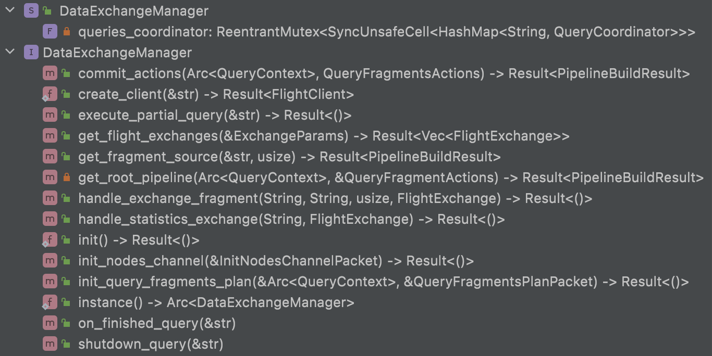
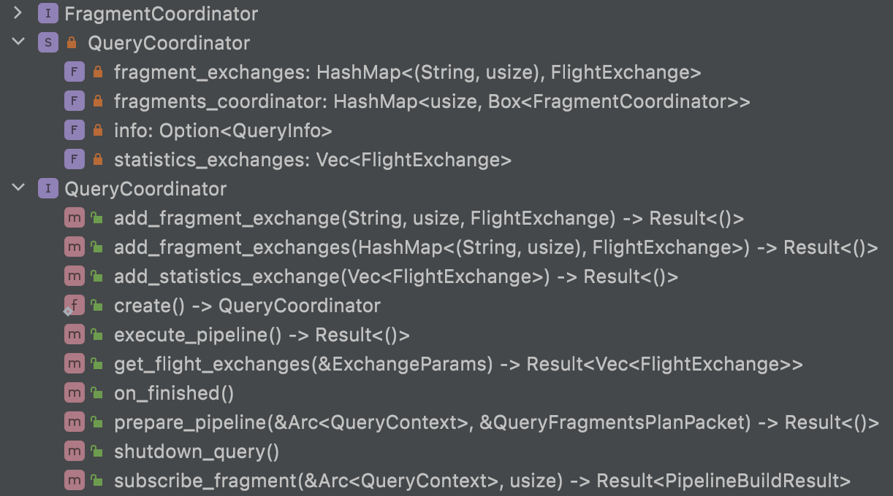
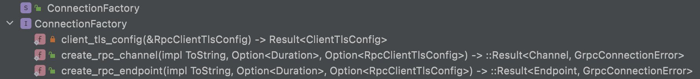

* [分布式查询调度器](#分布式查询调度器)

* [1 构造分布式Pipeline](#1-构造分布式pipeline)
  * [生成PlanFragment](#生成planfragment)
    * [Fragmenter](#fragmenter)
      * [fn build_fragment()](#fn-build_fragment)
      * [fn replace_exchange()](#fn-replace_exchange)
      * [fn get_exchange()⭐️](#fn-get_exchange)
    * [PlanFragment](#planfragment)
    * [FragmentType](#fragmenttype)
    * [DataExchange](#dataexchange)
  * [生成QueryFragmentsActions](#生成queryfragmentsactions)
    * [QueryFragmentsActions](#queryfragmentsactions)
    * [QueryFragmentActions](#queryfragmentactions)
    * [QueryFragmentAction](#queryfragmentaction)
    * [FragmentPayload](#fragmentpayload)
    * [PlanFragment的get_actions函数](#planfragment的get_actions函数)
  * [生成PipelineBuildResult](#生成pipelinebuildresult)
    * [DataExchangeManager](#dataexchangemanager)
      * [fn commit_actions() ⭐️](#fn-commit_actions-)
    * [QueryFragmentsActions](#queryfragmentsactions)
      * [fn get_init_nodes_channel_packets()](#fn-get_init_nodes_channel_packets)
      * [fn fragments_connections()](#fn-fragments_connections)
      * [fn get_query_fragments_plan_packets()](#fn-get_query_fragments_plan_packets)
      * [fn get_execute_partial_query_packets()](#fn-get_execute_partial_query_packets)
    * [QueryCoordinator](#querycoordinator)
    * [InitNodesChannelPacket](#initnodeschannelpacket)
      * [fn commit()](#fn-commit)
* [2 分布式查询的执行](#2-分布式查询的执行)
* [3 节点间的RPC通信](#3-节点间的rpc通信)
  * [创建Connection](#创建connection)
    * [fn create_client()](#fn-create_client)
    * [ConnectionFactory](#connectionfactory)
    * [FlightClient](#flightclient)
    * [DatabendQueryFlightService](#databendqueryflightservice)

## 分布式查询调度器

两个之前阅读过这块的代码（详见[分布式查询](../v0.7.71-nightly/3_distributed_query.md)），但是不够全面，而且Databend的更新频率太快，所以打算重新阅读新的代码，顺便记录一下。

相关代码路径：schedulers，rpc

```shell
schedulers
├── fragments // 将PhysicalPlan转换为分布式PlanFragment，用于构造分布式Pipeline
│   ├── fragmenter.rs
│   ├── mod.rs
│   ├── plan_fragment.rs // 分布式查询计划
│   ├── query_fragment_actions.rs // 带节点信息的分布式查询计划，并用于生成FlightClient与FlightService间通信的各种packet
│   └── query_fragment_actions_display.rs
├── mod.rs
└── scheduler.rs // 构造分布式Pipeline
2 directories, 7 files

rpc
├── exchange
│   ├── data_exchange.rs
│   ├── exchange_manager.rs // 维护Exchange任务⭐️
│   ├── exchange_params.rs
│   ├── exchange_sink.rs
│   ├── exchange_sink_merge.rs
│   ├── exchange_sink_shuffle.rs
│   ├── exchange_transform.rs
│   ├── exchange_transform_source.rs
│   ├── mod.rs
│   ├── statistics_receiver.rs
│   └── statistics_sender.rs
├── flight_actions.rs
├── flight_client.rs
├── flight_scatter.rs
├── flight_scatter_broadcast.rs
├── flight_scatter_hash.rs
├── flight_service.rs
├── mod.rs
├── packets
│   ├── mod.rs
│   ├── packet.rs
│   ├── packet_data.rs
│   ├── packet_data_precommit.rs
│   ├── packet_data_progressinfo.rs
│   ├── packet_execute.rs  // ExecutePartialQueryPacket，启动查询任务
│   ├── packet_executor.rs
│   ├── packet_fragment.rs // FragmentPlanPacket，发布查询任务
│   └── packet_publisher.rs // InitNodesChannelPacket，用于创建计算节点间Channels
└── request_builder.rs
3 directories, 28 files
```

### 1 构造分布式Pipeline

* 生成PlanFragment：分布式查询计划。
* 生成QueryFragmentsActions：带节点信息的分布式查询计划。
* 生成PipelineBuildResult：分布式Pipeline。

```rust
file: src/query/service/src/schedulers/scheduler.rs

/// Build distributed pipeline via fragment and actions.
pub async fn build_distributed_pipeline(
    ctx: &Arc<QueryContext>,
    plan: &PhysicalPlan,
) -> Result<PipelineBuildResult> {
    // 1 生成PlanFragment
    let fragmenter = Fragmenter::try_create(ctx.clone())?;
    let root_fragment = fragmenter.build_fragment(plan)?;
  
    // 2 生成QueryFragmentsActions
    let mut fragments_actions = QueryFragmentsActions::create(ctx.clone());
    root_fragment.get_actions(ctx.clone(), &mut fragments_actions)?;

    // 3 生成PipelineBuildResult
    let exchange_manager = ctx.get_exchange_manager();

    let mut build_res = exchange_manager
        .commit_actions(ctx.clone(), fragments_actions)
        .await?;

    let settings = ctx.get_settings();
    build_res.set_max_threads(settings.get_max_threads()? as usize);
    Ok(build_res)
}
```

#### 生成PlanFragment

```rust
    let fragmenter = Fragmenter::try_create(ctx.clone())?;
    let root_fragment = fragmenter.build_fragment(plan)?;
```

##### Fragmenter

```rust
file: src/query/service/src/schedulers/fragments/fragmenter.rs
/// Visitor to split a `PhysicalPlan` into fragments.
pub struct Fragmenter {
    ctx: Arc<QueryContext>,
    fragments: Vec<PlanFragment>,
    query_id: String,

    /// A state to track if is visiting a source pipeline.
    visiting_source_pipeline: bool,
}

```

###### fn build_fragment()

该函数通过遍历PhysicalPlan Tree，根据PhysicalPlan::Exchange来划分PlanFragment。

Fragmenter实现了`PhysicalPlanReplacer` trait的几个functions，包含`replace_table_scan`、`replace_hash_join`和`replace_exchange`。

###### fn replace_exchange()

该函数最最重要的功能就是生成PlanFragment，步骤如下：

* 生成新的input：遍历plan.input，得到新的input paln；
* 生成新的plan：PhysicalPlan::ExchangeSink
  * ```rust
            let plan = PhysicalPlan::ExchangeSink(ExchangeSink {
                input: Box::new(input),
                schema: input_schema.clone(),
                kind: plan.kind.clone(),
                keys: plan.keys.clone(),

                destinations: Self::get_executors(self.ctx.clone()),
                query_id: self.query_id.clone(),

                // We will connect the fragments later, so we just
                // set the fragment id to a invalid value here.
                destination_fragment_id: usize::MAX,
            });
    ```
* 生成fragment_type：根据self.visiting_source_pipeline的标记来判断要生成的PlanFragment的类型，FragmentType::Source或着FragmentType::Intermediate；
* 生成exchange：Option\<DateExchange\> ⭐️
  * ```rust
            let exchange = Self::get_exchange(
                self.ctx.clone(),
                &plan,
                self.fragments
                    .iter()
                    .all(|fragment| !matches!(&fragment.exchange, Some(DataExchange::Merge(_)))),
            )?;
    ```
* 生成fragment_id：self.ctx.get_fragment_id()；
* 生成fragment：
  * ```rust
            let mut fragment = PlanFragment {
                plan,
                fragment_type,

                fragment_id: source_fragment_id,
                exchange,
                query_id: self.query_id.clone(),

                source_fragments: self.fragments.drain(..).collect(),
            };
    ```
* 给fragment.sourcec_fragments的ExchageSink设置fragment.fragment_id：`Self::resolve_fragment_connection(&mut source_fragment);`
* 将上述产生的fragment放入self.fragments；
* 返回PhysicalPlan::ExchnageSource
  * ```rust
            Ok(PhysicalPlan::ExchangeSource(ExchangeSource {
                schema: input_schema,
                query_id: self.query_id.clone(),

                source_fragment_id,
            }))
    ```

###### fn get_exchange()⭐️

```rust
    pub fn get_exchange(
        ctx: Arc<QueryContext>,
        plan: &PhysicalPlan,
        from_multiple_nodes: bool,
    ) -> Result<Option<DataExchange>> {
        match plan {
            PhysicalPlan::ExchangeSink(plan) => match plan.kind {
                FragmentKind::Normal => Ok(Some(ShuffleDataExchange::create(
                    Self::get_executors(ctx), // 设置下游节点为当前集群的所有节点
                    plan.keys.clone(),
                ))),
                FragmentKind::Merge => {
                    Ok(Some(MergeExchange::create(Self::get_local_executor(ctx)))) // 设置为当前节点
                }
                FragmentKind::Expansive => Ok(Some(BroadcastExchange::create(
                    from_multiple_nodes,
                    Self::get_executors(ctx), // 设置为所有节点
                ))),
                _ => Ok(None),
            },
            _ => Ok(None),
        }
    }
```

##### PlanFragment

分布式的查询计划

```rust
file: src/query/service/src/schedulers/fragments/plan_fragment.rs
pub struct PlanFragment {
    pub plan: PhysicalPlan,
    pub fragment_type: FragmentType,
    pub fragment_id: usize,
    pub exchange: Option<DataExchange>,
    pub query_id: String,

    // The fragments to ask data from.
    pub source_fragments: Vec<PlanFragment>,
}
```

##### FragmentType

```rust
file: src/query/service/src/schedulers/fragments/plan_fragment.rs
pub enum FragmentType {
    /// Root fragment of a query plan
    Root,

    /// Intermediate fragment of a query plan,
    /// doesn't contain any `TableScan` operator.
    Intermediate,

    /// Leaf fragment of a query plan, which contains
    /// a `TableScan` operator.
    Source,
}
```

##### DataExchange

```rust
// file: src/query/service/src/api/rpc/exchange/data_exchange.rs
pub enum DataExchange {
    Merge(MergeExchange),
    Broadcast(BroadcastExchange),
    ShuffleDataExchange(ShuffleDataExchange),
}
```

#### 生成QueryFragmentsActions

```rust
    let mut fragments_actions = QueryFragmentsActions::create(ctx.clone());
    root_fragment.get_actions(ctx.clone(), &mut fragments_actions)?;
```

##### QueryFragmentsActions

##### QueryFragmentActions

##### QueryFragmentAction

##### FragmentPayload

```rust
file: src/query/service/src/schedulers/fragments/query_fragment_actions.rs
/// 多个PlanFragment的分布式任务集合
pub struct QueryFragmentsActions {
    ctx: Arc<QueryContext>,
    pub fragments_actions: Vec<QueryFragmentActions>,
}

/// 来自于一个PlanFragment的多个分布式任务
pub struct QueryFragmentActions {
    pub fragment_id: usize,
    pub exchange_actions: bool,
    pub data_exchange: Option<DataExchange>,
    pub fragment_actions: Vec<QueryFragmentAction>,
}

/// 属于一个节点的查询任务
pub struct QueryFragmentAction {
    pub payload: FragmentPayload,
    pub executor: String,
}

pub enum FragmentPayload {
    Plan(PhysicalPlan),
}
```

##### PlanFragment的get_actions函数

* 后序遍历PlanFragment Tree，给每个PlanFragment生成一个QueryFramentActions，并放入QueryFragmentsActions；
* 给每个PlanFragment配置相应的计算节点(一个或多个)，每个节点生成一个的QueryFragmentAction，并放入QueryFragmentActions中。
  * 配置一个节点的情况包含：
    * fragment_type为FragmentType::Root的；
    * fragment_type为FragmentType::Intermediate，且任意一个source_fragments包含DaaExchange::Merge的；
  * 配置多个节点的情况包含：
    * fragment_type为FragmentType::Intermediate，且所有source_fragments不包含DaaExchange::Merge的；
    * fragment_type为FragmentType::Source的，这里会调用`redistribute_source_fragment`函数对Source任务的Partitions进行一个reshuffle操作，并返回一个QueryFragmentActions，即多个QueryFragmentAction。

#### 生成PipelineBuildResult

```rust
    let exchange_manager = ctx.get_exchange_manager();

    let mut build_res = exchange_manager
        .commit_actions(ctx.clone(), fragments_actions)
        .await?;

    let settings = ctx.get_settings();
    build_res.set_max_threads(settings.get_max_threads()? as usize);
    Ok(build_res)
```

##### DataExchangeManager

全局单例

```rust
// file: src/query/service/src/api/rpc/exchange/exchange_manager.rs
pub struct DataExchangeManager {
    queries_coordinator: ReentrantMutex<SyncUnsafeCell<HashMap<String, QueryCoordinator>>>,
}
```



###### fn commit_actions() ⭐️

// TODO 画个流程图

在Scheduler调用，用于往远程DatabendQueryFlightService发送请求。

这个函数在代码中有注释，这里再简单说明一下细节。

* 初始化集群节点间的Channels，这里会往远程节点发送rpc请求；
  * ```rust
            actions
                .get_init_nodes_channel_packets()? // 获取Vec<InitNodesChannelPacket>
                .commit(conf.as_ref(), timeout) // 调用InitNodesChannelPacket的commit函数，这里创建了节点间的rpc channel ⭐️
                .await?;
    ```
* 创建本地和远程Executor的QueryFragmentPlanPacket
  * ```rust
            let (local_query_fragments_plan_packet, query_fragments_plan_packets) =
                actions.get_query_fragments_plan_packets()?;
    ```
* 提交上述query_fragments_plan_packets到远程Executor
  * ```rust
            query_fragments_plan_packets
                .commit(conf.as_ref(), timeout) // 调用QueryFragmentsPlanPacket的commit函数
                .await?;
    ```
* 提交上述local_query_fragments_plan_packet到本地Executor
  * ```rust
    self.init_query_fragments_plan(&ctx, &local_query_fragments_plan_packet)?;
    ```
* 创建root QueryFragmentActions的PipelineBuildResult
  * ```rust
    let build_res = self.get_root_pipeline(ctx, root_actions)?; ⭐️
    ```
* 提交执行查询的请求
  * ```rust
            actions
                .get_execute_partial_query_packets()?
                .commit(conf.as_ref(), timeout)
                .await?;
    ```
* 返回Pipeline
  * ```rust
    Ok(build_res)
    ```

##### QueryFragmentsActions

###### fn get_init_nodes_channel_packets()

生成集群节点间的Connection关系，返回`Vec<InitNodesChannelPacket>`

* 初始化local_id和node_info:
  * ```rust
            let local_id = &self.ctx.get_cluster().local_id; // 获取当前节点id
            let nodes_info = Self::nodes_info(&self.ctx); // 获取集群所有节点信息
    ```
* 获取connections_iofo：`self.fragments_connections()`，返回`Map<SourceNode, Map<DestinationNode, Vec<FragmentId>>>`
* 初始化init_nodes_channel_packets：`let mut init_nodes_channel_packets = Vec::with_capacity(connections_info.len());`
* 遍历connections_iofo：`for(executor, fragments_connections) in &connections_iofo`
  * 如果nodes_info中不包含executor，则报错；
  * 获取executor_node_info：`let executor_node_info = &nodes_info[executor];`
  * 初始化connections_info：`let mut connections_info = Vec::with_capacity(fragments_connections.len());`
  * 遍历fragments_connections：`for (target, fragments) in fragments_connections `
    * 如果nodes_info中不包含target，则报错；
    * 若包含，则创建ConnectionInfo，并放入connections_info中：
      * ```rust
                        connections_info.push(ConnectionInfo {
                            target: nodes_info[target].clone(),
                            fragments: fragments.iter().cloned().unique().collect::<Vec<_>>(),
                            create_request_channel: &executor_node_info.id == local_id
                                || target == local_id,
                        });
        ```
  * 把connections_info放入init_nodes_channel_packets
    * ```rust
                  init_nodes_channel_packets.push(InitNodesChannelPacket::create(
                      self.ctx.get_id(), // query id
                      executor_node_info.clone(), // source节点信息
                      connections_info,  // target节点信息
                  ));
      ```
* 返回Ok(init_nodes_channel_packets)

###### fn fragments_connections()

返回 Map\<SourceNode, Map\<DestinationNode, Vec\<FragmentId\>\>\>

We can exchange data on one connection, so let's plan how to use the least connections to complete the query.

过程如下：

* 初始化返回结果`let mut source_target_fragments = HashMap::<String, HashMap<String, Vec<usize>>>::new();`
* 遍历self.fragment_actions，只处理包含DataExchange的QueryFragments；
  * 生成fragment_id：获取当前QueryFragmentActions的fragment_id；
  * 生成destinations：获取下游的计算节点id，`exchange.get_destinations()`，这些id是在Fragmenter的`get_exchange()`函数中设置的；
  * 遍历当前QueryFragmentActions包含的每个QueryFragmentAction；
    * 获取source：当前Action所属的节点；
    * 遍历上述destinations，
      * 如果souce与destiontion相同，则跳过；
      * 否则，把`(source, (destination, fragment_id))`放入source_target_fragments。

###### fn get_query_fragments_plan_packets()

返回：`(QueryFragmentsPlanPacket, Vec<QueryFragmentsPlanPacket>)`

步骤如下：

* 获取nodes_info：集群节点信息`let nodes_info = Self::nodes_info(&self.ctx);`
* 获取fragments_packets：每个节点的FragmentPlanPacket，`let mut fragments_packets = self.get_executors_fragments();`
* 初始化query_fragments_plan_packets：`let mut query_fragments_plan_packets = Vec::with_capacity(fragments_packets.len());`
* 生成local_query_fragments_plan_packet：本地节点的QueryFragmentsPlanPacket
  * ```rust
            let local_query_fragments_plan_packet = QueryFragmentsPlanPacket::create(
                self.ctx.get_id(),
                cluster.local_id.clone(),
                fragments_packets.remove(&cluster.local_id).unwrap(), // 并移除
                nodes_info.clone(),
                cluster.local_id(),
            );
    ```
* 遍历剩余的fragments_packets，并为创建每个executor的QueryFragmentsPlanPacket
  * ```rust
            for (executor, fragments) in fragments_packets.into_iter() {
                let query_id = self.ctx.get_id();
                let executors_info = nodes_info.clone();

                query_fragments_plan_packets.push(QueryFragmentsPlanPacket::create(
                    query_id,
                    executor,
                    fragments,
                    executors_info,
                    cluster.local_id(),
                ));
            }
    ```
* 返回
  * ```rust
            Ok((
                local_query_fragments_plan_packet,
                query_fragments_plan_packets,
            ))
    ```

###### fn get_execute_partial_query_packets()

返回：`Vec<ExecutePartialQueryPacket>`

* 获取nodes_info：集群节点信息`let nodes_info = Self::nodes_info(&self.ctx);`
* 初始化execute_partial_query_packets：`let mut execute_partial_query_packets = Vec::with_capacity(nodes_info.len());`
* 遍历上述nodes_info，并创建每个node的Packet
  * ```rust
            for node_id in nodes_info.keys() {
                execute_partial_query_packets.push(ExecutePartialQueryPacket::create(
                    self.ctx.get_id(),
                    node_id.to_owned(),
                    nodes_info.clone(),
                ));
            }
    ```
* 返回`Ok(execute_partial_query_packets)`

##### QueryCoordinator



##### InitNodesChannelPacket

用于初始化查询节点间的Channel

```rust
// file: src/query/service/src/api/rpc/packets/packet_publisher.rs
pub struct InitNodesChannelPacket {
    pub query_id: String,
    pub executor: Arc<NodeInfo>,
    pub connections_info: Vec<ConnectionInfo>,
}

pub struct ConnectionInfo {
    pub target: Arc<NodeInfo>,
    pub fragments: Vec<usize>,
    pub create_request_channel: bool,
}
```

###### fn commit()

```rust
impl Packet for InitNodesChannelPacket {
    async fn commit(&self, config: &Config, timeout: u64) -> Result<()> {
        let executor_info = &self.executor;
        let mut conn = create_client(config, &executor_info.flight_address).await?; // 创建FlightClient，详见第3节
        let action = FlightAction::InitNodesChannel(InitNodesChannel {
            init_nodes_channel_packet: self.clone(),
        });
        conn.execute_action(action, timeout).await // 调用FlightClient的execute_action()发送InitNodes请求⭐️
    }
}
```

### 2 分布式查询的执行

### 3 节点间的RPC通信

#### 创建Connection

##### fn create_client()

```rust
// file: src/query/service/src/api/rpc/packets/packet.rs
pub async fn create_client(config: &Config, address: &str) -> Result<FlightClient> {
    match config.tls_query_cli_enabled() {
        true => Ok(FlightClient::new(FlightServiceClient::new(
            ConnectionFactory::create_rpc_channel(
                address.to_owned(),
                None,
                Some(config.query.to_rpc_client_tls_config()),
            )
            .await?,
        ))),
        false => Ok(FlightClient::new(FlightServiceClient::new(
            ConnectionFactory::create_rpc_channel(address.to_owned(), None, None).await?,
        ))),
    }
}
```

##### ConnectionFactory



##### FlightClient

与DatabendQueryFlightService通信

```rust
// file: src/query/service/src/api/rpc/flight_client.rs
pub struct FlightClient {
    inner: FlightServiceClient<Channel>,
}

```

##### DatabendQueryFlightService

```rust
    async fn do_action(&self, request: Request<Action>) -> Response<Self::DoActionStream> {
        common_tracing::extract_remote_span_as_parent(&request);

        let action = request.into_inner();
        let flight_action: FlightAction = action.try_into()?;

        let action_result = match &flight_action {
            FlightAction::InitQueryFragmentsPlan(init_query_fragments_plan) => {
                let session = SessionManager::instance()
                    .create_session(SessionType::FlightRPC)
                    .await?;
                let ctx = session.create_query_context().await?;
                DataExchangeManager::instance()
                    .init_query_fragments_plan(&ctx, &init_query_fragments_plan.executor_packet)?;

                FlightResult { body: vec![] }
            }
            FlightAction::InitNodesChannel(init_nodes_channel) => {
                let publisher_packet = &init_nodes_channel.init_nodes_channel_packet;
                DataExchangeManager::instance()
                    .init_nodes_channel(publisher_packet)
                    .await?;

                FlightResult { body: vec![] }
            }
            FlightAction::ExecutePartialQuery(query_id) => {
                DataExchangeManager::instance().execute_partial_query(query_id)?;

                FlightResult { body: vec![] }
            }
        };
```
